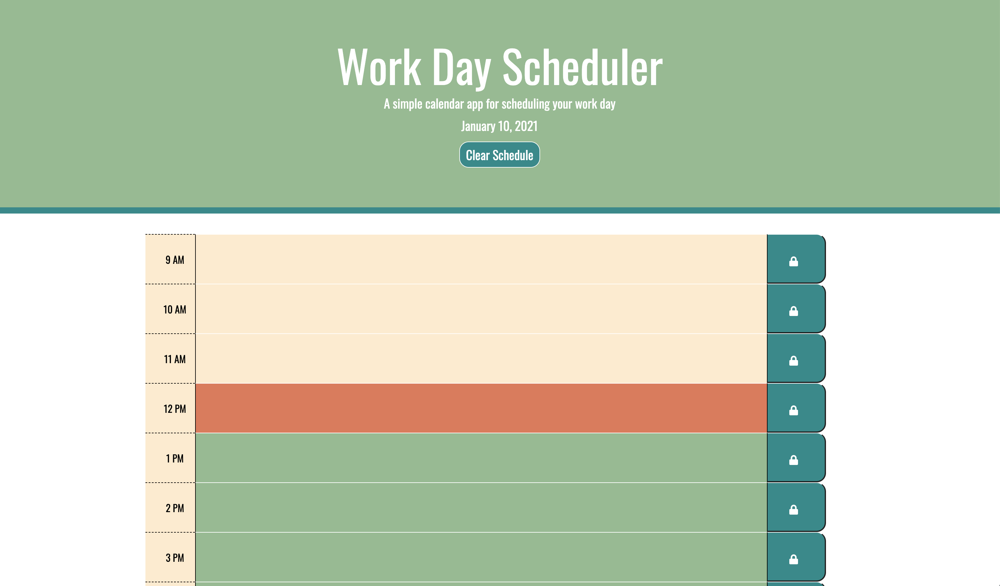

# Work Day Scheduler
#### This application allows professionals to create an hourly schedule for their daily work.

### I was provided with initial HTML and CSS files. I edited these files, and also created a Javascipt file to allow for DOM manipulation and persistent information. 
    * The schedule displays the current date, and is broken down by each hour 9 AM - 5 PM.
    * The user can click on each time slot, and enter text describing their schedule item.
        * Once they click the save button, their text will be saved to local storage, and can be retrieved even once the page is refreshed.
        * The user can also edit text that has been previously entered.
    * The calendar shows the hours color coded by past (beige), present (red), and future (green).
    * The user can clear their entire schedule using the button under the heading. 
    
### [Work Day Scheduler](https://meganbryan.github.io/WorkDayScheduler/)
### 
